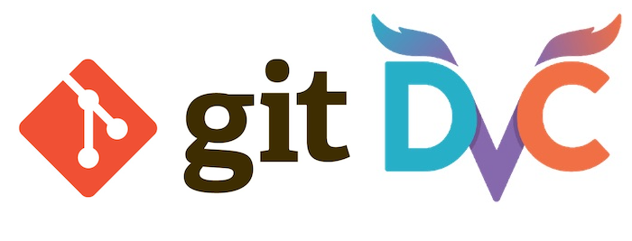

# MLOps tools for efficient and reproducible research

The current repository provides a step-by-step tutorial for recent MLOps tools and how they can be adopted and used to improve efficiency and reproducibility in academic setups. This repo is destined for junior scientist at early stages of their research as well as more experienced scholars who would like learn about recent MLOps tools. 

The tools presented aim to replace spreadsheet and document sharing tools (such as Excel or Google Docs) frequently used as knowledge repositories. They also replace both ad-hoc scripts to track, move, and save  different model versions and ad-hoc data file suffixes and prefixes.

The current content was presented as part of the DECIDE Seminar at the university of Klagenfurt (W21).

## Data Versioning Control (DVC)
 

Data Versioning can be defined as the action of tracking the changes data and more genrally all large files. DVC is one of the most popular tools in python. It has git similar syntax and allow to track the large files on remote storage space linking them directly to github. 

Did DVC catch your attention? Are you curious to find out more about it? [Intro to DVC](./dv.md)  is the right place for you :) !

## Experiment Management with MLflow
 

The experiment management refers to the organization and tracking of artifacts generated by different experiments conducted during a project in general. As research projects like PhDs are just a type of project, they can find huge benefits from automating such practice. It allows the junior scientist to follow their progress along the research, analyze/ compare the obtained results, and share their results in a friendly format requiring minimalistic coding. MLflow is an open-source package designed specificaly for such uses. 

Are you interested in learning more about Mlflow ? [Intro to MLflow](./mlflow.md)  is the right place for you :) !

## Hyper-parameters Optimization with Optuna
 

Research process is a tedious process requiring the exploration of different parameters to find the best performing model. Using a grid search is a good approach. However, in some cases the guided search allow a more finite exploration of the area of interest and thus allow for a more straight forward search. The automation of this process becomes thus a must to relieve the developer from the burden of saving manual sabing of parameters and model management. In this respect, Optuna is an easy-to-use python package offering all previously described features. 

Is Optuna of interest for you work ? Check [Intro to Optuna](./mlflow.md)   for a detailed tutorial about Optuna and how it can be used with MLflow !

#### Usefull ressources:
1.  https://fullstackdeeplearning.com/
2.  https://cloud.google.com/architecture/mlops-continuous-delivery-and-automation-pipelines-in-machine-learning
3.  https://ml-ops.org/

